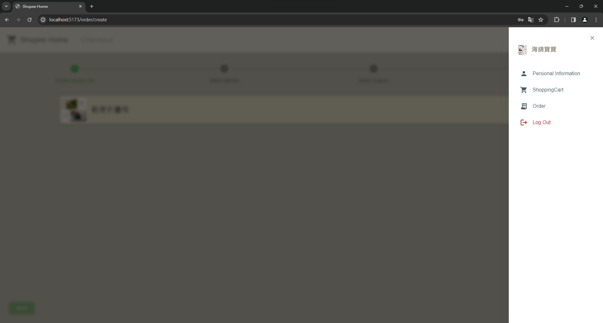
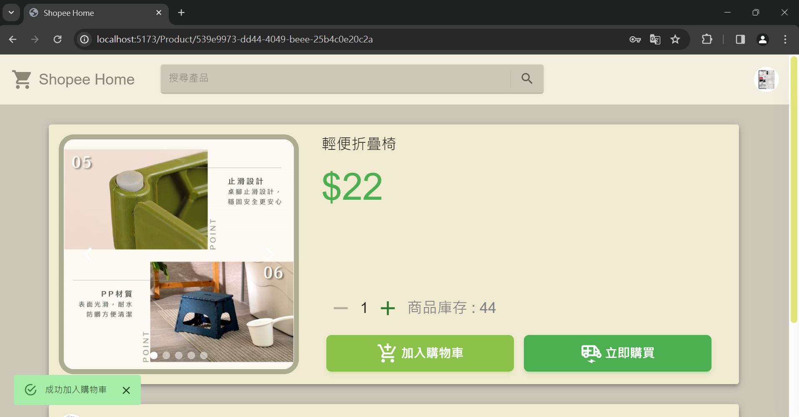
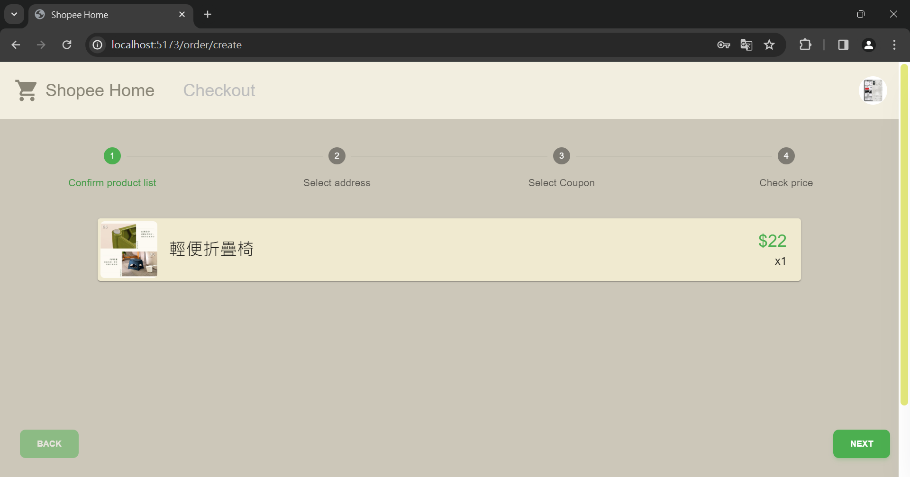

# ShopeeHome-frontend-User

## 安裝

1. 安裝Node.js
2. 開啟cmd，在ShopeeHome-frontend目錄下輸入 `npm install`
3. 輸入 `npm run dev`
4. 把螢幕上出現的網址貼到禁用CORS政策的Google Chrome瀏覽器 

## 使用方式

### 1. client (未登入)
   1. 在未登入的情況下，訪客可以在首頁瀏覽所有商品。
   
   2. 也可以在上方搜尋欄用關鍵字搜尋商品。
   
   
   3. 也能點擊任意產品進入產品頁面，但是點擊加入購物車或是立即購買後會進入登入頁面，需要先登入才能進行操作。
      點擊下方產品資訊欄會展開並顯示產品資訊。
   
   4. 點擊產品頁中間的賣家欄位會轉到賣家頁面。
      按左側按鈕可以看到商家的所有商品。
      中間可以看到店家資訊。
      右側是商店的優惠券資訊，但是沒有登入看不到。
      
      
      
   5. 在任何地方只要點擊左上角的Logo就能回到網站主頁。

### 2. user 
   1. 在未登入情況下按右上角人頭圖像會移至登入頁面。
      
   2. 點擊右下角的sign up進入註冊頁面。
      可以點擊註冊欄位上方的頭像上傳大頭貼(非必要)，如果沒上傳，大頭貼為name的第一個字元+根據name欄位計算出來的背景顏色。
      註冊成功後自動回到登入頁面，即可使用剛註冊的帳號密碼進行登入。
      (注意: 不可用相同email重複註冊。)
      (不註冊的話可以用我們的測試帳號 email: user1@gmail.com , password: user1)
      
   3. 登入後點擊右上角user頭像可以打開drawer，從drawer可以連到user的各個相關頁面以及登出。
      
   4. 按下Personal Information 會先要求重新輸入帳號密碼確認身份後，跳到個人資訊修改頁面。
   5. 按下添加地址即可在個人資訊中添加常用地址以加快結帳速度（常用地址會顯示在結帳介面）。
   6. 登入後的user可以使用client的所有功能，包括剛剛提到user無法領取的優惠券。
      (商店頁面可以看到優惠券，黑色代表未領取、綠色打勾代表已領取、灰色代表已使用)
      
   7. 在商品頁面按+-按鈕選擇數量，按下加入購物車且加入成功時左下角會出現提示，可以去購物車結帳完成訂單。
      
   8. 或者按下立即購買按鈕後會直接進入購買頁面（後面一起介紹）。
      
   9. 打開右上角頭像按下ShoppingCart即可前往購物車。
   10. 選擇想結帳的商品內容，同一筆訂單可以選擇同一商家的部分商品或全部商品進行結帳，不可以選擇不同商店的商品進行結帳。（勾選有設計無法同時勾選不同商店的商品）。
   11. 在結帳頁面可以選擇之前輸入的地址或是自行輸入想要運送的地址。（剛剛按下直接購買也是跳到這個界面）。
   12. 按下下一頁之後可以選擇剛才在商家領取的優惠卷，再次按下可取消使用。
   13. 按下下一頁之後跳轉至確認下訂的頁面，按下立即下訂即下單成功。
   14. 接下來可以按下user頭像，選擇Order查看訂單狀況，現在的狀況是尚未出貨。
   15. 在賣家出貨之後會變成以下畫面（賣家出貨流程請見賣場的README），按下取貨即可看到取貨成功的畫面。
   16. 按下user頭像，選擇Log Out登出，即變成登出狀態。

以上是ShopeeHome-frontend-User的安裝和使用說明大綱。
